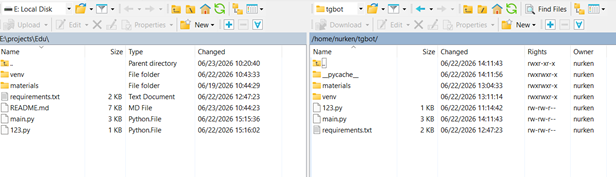


# Ubuntu 24.04.04 серверінде Telegram-ботты іске қосу (Deploy) нұсқаулығы

Бұл құжат Linux (Ubuntu 24.04.04) операциялық жүйесінде виртуалды ортаны (venv) пайдалана отырып, Python негізіндегі жобаны қашықтағы серверде іске қосудың қадамдық процесін сипаттайды.

## 1. Файлдарды серверге тасымалдау (WinSCP)

Бастапқы кодты локальды компьютерден серверге тасымалдау үшін SFTP хаттамасы (WinSCP клиенті арқылы) қолданылды.
Келесі компоненттер көшірілді:

* `main.py` — боттың логикасы жазылған негізгі скрипт.
* `requirements.txt` — қажетті тәуелділіктер (кітапханалар) тізімі бар файл.
* `materials/` — RAG-модель жұмысына арналған PDF-құжаттар бар директория.

****
* Файлдарды пайдаланушының `/home/nurken/tgbot/` директориясына көшіру процесі.*

## 2. Серверде ортаны дайындау

Бұдан кейінгі барлық әрекеттер серверге SSH-қосылым арқылы орындалады.

**2.1-қадам. Жоба директориясына өту**

```bash
cd /home/nurken/tgbot/

```

*Не үшін қажет:* WinSCP арқылы файлдар жүктелген жұмыс папкасына өтеміз. `ls -l` командасы қажетті файлдардың бар екенін растайды.

**2.2-қадам. Виртуалды ортаны (venv) құру**

```bash
python3 -m venv venv

```

*Не үшін қажет:* `venv` модулі жоба үшін оқшауланған орта (venv папкасы) құрады. Бұл әзірлеудегі дұрыс тәжірибе: біз кітапханаларды глобалды түрде Ubuntu жүйесіне орнатпаймыз, бұл жүйелік тәуелділіктерді (apt-пакеттерді) бұзбау үшін қажет.

**2.3-қадам. Виртуалды ортаны іске қосу (активация)**

```bash
source venv/bin/activate

```

*Не үшін қажет:* Командалық жол интерпретаторын құрылған `venv` папкасындағы Python мен pip-ті қолдануға ауыстырады. Консольде `(venv)` префиксі пайда болады.

**2.4-қадам. Тәуелділіктерді (кітапханаларды) орнату**

```bash
pip install -r requirements.txt

```

*Не үшін қажет:* `pip` пакеттік менеджері `requirements.txt` файлын оқиды және қажетті кітапханаларды (мысалы, `google-generativeai` және `python-telegram-bot`) қатаң көрсетілген нұсқалар бойынша орнатады.

## 3. Желілік қауіпсіздікті баптау (Ports & Firewall)

**Архитектура ерекшелігі:**
Скрипт Telegram API-ден жаңартуларды алу үшін **Long Polling** әдісін пайдаланады.

* **Шығыс трафик (Outgoing):** `api.telegram.org` және Google Gemini API-ге сұраныстар жіберу үшін стандартты TCP-порт 443 (HTTPS) ашық.
* **Кіріс трафик (Incoming): Жабық**. Біз Webhook архитектурасын қолданбайтындықтан, брандмауэрде (UFW) кіріс порттарын (8443, 443) ашудың немесе өзі қол қойған (self-signed) SSL-сертификаттарды генерациялаудың қажеті жоқ. Сервер сыртқы қосылымдарды қабылдамайды, бұл сырттан шабуыл жасау қаупін барынша азайтады.

## 4. Жобаны фондық қызмет ретінде іске қосу (Systemd)

SSH-сессия жабылғаннан кейін бот өшіп қалмауы үшін ол Linux жүйелік қызметі (daemon) ретінде бапталған.

**4.1-қадам. Қызметтің конфигурациялық файлын құру**

```bash
sudo nano /etc/systemd/system/tgbot.service

```

**4.2-қадам. Қызметті конфигурациялау**
Файл ішіне келесі конфигурация жазылады:

```ini
[Unit]
Description=Huawei Datacom Telegram Bot
After=network.target

[Service]
User=nurken
WorkingDirectory=/home/nurken/tgbot
ExecStart=/home/nurken/tgbot/venv/bin/python /home/nurken/tgbot/main.py
Restart=always

[Install]
WantedBy=multi-user.target

```

*Не үшін қажет:* - `ExecStart` қызмет дұрыс кітапханалармен іске қосылуы үшін виртуалды ортадағы Python-ның толық жолын көрсетеді.

* `Restart=always` егер бот жүйелік қатеге немесе байланыстың үзілуіне байланысты тоқтап қалса, Ubuntu оны автоматты түрде қайта қосатынына кепілдік береді.

**4.3-қадам. Қызметті іске қосу және автожүктеуге қосу**

```bash
sudo systemctl daemon-reload
sudo systemctl start tgbot
sudo systemctl enable tgbot

```

*Не үшін қажет:* systemd конфигурациясын қайта жүктейміз, ботты іске қосамыз және оны автожүктеуге (сервер қайта қосылғанда бот өзі қосылуы үшін) қосамыз.

**4.4-қадам. Статусты тексеру**

```bash
sudo systemctl status tgbot

```

*Не үшін қажет:* Бұл команда қызметтің логтарын шығарып, процестің іске қосылғанын және қатесіз жұмыс істеп тұрғанын растайды.

---
